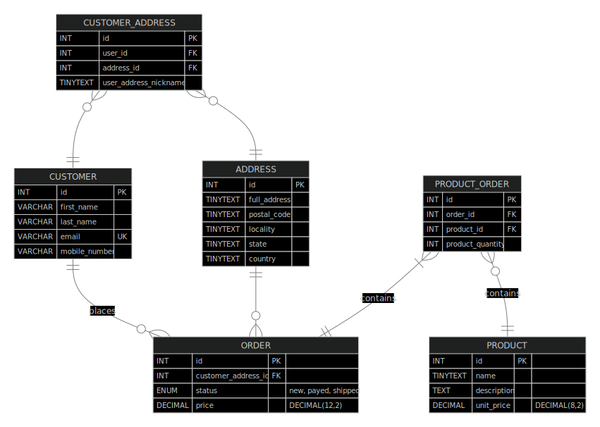

# Design Document

MySQL database for an e-commerce website By Nazar MELNYK

Video overview: <URL HERE>

## Scope

> In this section you should answer the following questions:
> 
> * What is the purpose of your database?
> * Which people, places, things, etc. are you including in the scope of your database?
> * Which people, places, things, etc. are *outside* the scope of your database?

The system [we are going to build a database for] is a simplified version of an e-commerce website, where customers can make their orders.

The purpose of the database is to describe all the essential entities and actions which could possibly happen while using the system.

The system is composed of the following main entities:
- Customer
- Product
- Order
- Address

Out of scope are:

- **Seller**. We suppose there exists only one generic seller
- **Stock**. We suppose products are available in unlimited quantities
- **Payment**. We suppose customer always has sufficient resources and every payment is successful, and the seller is automically reimbursed for thier products
- **Shipment**. We suppose every shipment is successful, without delays and package damages

## Functional Requirements

> In this section you should answer the following questions:
> 
> * What should a user be able to do with your database?
> * What's beyond the scope of what a user should be able to do with your database?

As per the section [`scope`](#scope) the only user of the system is the Customer. Such that the interaction of other User with the database is not considered in this document.

*Scope*: The Customer can :
- with regards to a **product** :
    - add a product item to a shopping cart,
    - adjust its quantity within a shopping cart,
    - remove an item from the shopping cart
- with regards to a **shipping address** :
    - add new shipping address
    - edit shipping address
    - remove shipping address
- with regards to an **order**:
    - select the shipping address
    - make the payment

*Out of scope*: The **Customer** cannot: 
- with regards to the **product**:
     - Create a new product
    - Modify existing product
- with regards to the **order**:
    - cancel / modify a payed order

## Representation

> In this section you should answer the following questions:
> 
> * Which entities will you choose to represent in your database?
> * What attributes will those entities have?
> * Why did you choose the types you did?
> * Why did you choose the constraints you did?

### Entities

Inside the `marketplace.db` you will find the entitilies listed and described more in details just below

- Product

    - `id` INT AUTO_INCREMENT PRIMARY KEY, which is the ID of the product. 
    
            - INT type is aimed at allowing us to create as many records, as we expect
            - AUTO_INCREMENT constraint ensures that the value is automatically generated and incremented for every new row
            - PRIMARY KEY ensures that each row in the table can be uniquely identified using the `id` column

        > INT unsigned range is from 0 to 4294967295.

    - `name` VARCHAR(70) NOT NULL, which is the name (or Title) of the product
    
            - The type VARCHAR aimed at optimizing the hard memory and the constraint of 70 is set to safely cover the most common length
            - NOT NULL, because we want this attribute to always have a value
        
        > VARCHAR(size). A variable length string (can contain letters, numbers, and special characters). The size parameter specifies the maximum column length in characters - can be from 0 to 65535

    - `description` TEXT, which is the description of the product
    
            Could be long enough for a few paragraphs, thus the TEXT type is used
    
        > A TEXT column with a maximum length of 65,535 (216 − 1) characters.
    
    - `unit_price_USD` DECIMAL(12,2) NOT NULL, which is a price per unit of the product
    
            - The DECIMAL type is aimed at optimizing the hard memory
            - The constraint of 2 on decimal digits is sufficient for an e-commerce marketplace. 
            - The total length of 12 is expected to be sufficient for any product expected to be sold
            - NOT NULL, because we don't want the price to be zero

    - `datetime_created` DATETIME(0) DEFAULT CURRENT_TIMESTAMP, which the timestamp of the when the product was created
    
            - The DATETIME(0) type combines the date and time into one single value with the 0 decimals precision for seconds
            - DEFAULT CURRENT_TIMESTAMP sets the default value to the current datetime (of the moment when the record is created)

    - `datetime_last_changed`  DATETIME(0) DEFAULT NULL ON UPDATE CURRENT_TIMESTAMP, which the timestamp of the when the product was updated
    
            - The DATETIME(0) type combines the date and time into one single value with the 0 decimals precision for seconds
            - DEFAULT NULL sets the default value to NULL, such that if the value remains NULL we know that the record was not updated
            - ON UPDATE CURRENT_TIMESTAMP sets the value to the current datetime corresponding to the moment, when the record was updated

- Customer

    - `id` INT AUTO_INCREMENT PRIMARY KEY, which is the ID of the Customer
    
            the reasoning is the same as (or similar to) the one available for the `product`(`id`) 

    - `first_name` VARCHAR(70) NOT NULL, which is the first name of the Customer. The Customer can have many first names, in such a case they should write them into this single field (e.g. Jean, Phillipe)
    
            - the constraint of 70 is set to safely cover the most common length

            - NOT NULL, because we don't want the first name to be zero
    
    - `last_name` VARCHAR(70) NOT NULL, which is the last name of the Customer. The Customer can have *complex* last names, in such a case they should write them into this single field (e.g. Martinez-Rodriquez)
    
            - concerning the attribute's type and its constraints, the same reasoning is applied as for the attribute above

            - NOT NULL, because we don't want the last name to be zero
    
    - `email` VARCHAR(70), which is the email associated with the Customer
    
            concerning the attribute's type and its constraints, the same reasoning is applied as for the attribute above
    
    - `mobile_number` VARCHAR(20), which is the mobile phone number associated with the Customer
        
            concerning the attribute's type and its constraints, the same reasoning is applied as for the attribute above
    
     - `datetime_created` DATETIME(0) DEFAULT CURRENT_TIMESTAMP, which the timestamp of the when the customer was created
    
            - The DATETIME(0) type combines the date and time into one single value with the 0 decimals precision for seconds
            - DEFAULT CURRENT_TIMESTAMP sets the default value to the current datetime (of the moment when the record is created)

    - `datetime_last_changed`  DATETIME(0) DEFAULT NULL ON UPDATE CURRENT_TIMESTAMP, which the timestamp of the when the customer details were updated
    
            - The DATETIME(0) type combines the date and time into one single value with the 0 decimals precision for seconds
            - DEFAULT NULL sets the default value to NULL, such that if the value remains NULL we know that the record was not updated
            - ON UPDATE CURRENT_TIMESTAMP sets the value to the current datetime corresponding to the moment, when the record was updated
    
- Address

    - `id` INT AUTO_INCREMENT PRIMARY KEY, which is the ID of the Address
    
            the reasoning is the same as (or similar to) the one available for the `product`(`id`)

    - `full_address` VARCHAR(100) NOT NULL', which is the full address (e.g. 6 avenue de la Bourdonnais)

            - VARCHAR type aimed at optimizing the hard memory
            - VARCHAR(100) constraint ensures the User can input any full address reasonably long
            - NOT NULL, otherwise the delivery might not be possible

    - `locality` VARCHAR(50) NOT NULL, which is the name of the locality (city, tow, village, etc., e.g. Paris)
    
            - VARCHAR type aimed at optimizing the hard memory
            - VARCHAR(50) constraint ensures the User can input any locality name reasonably long
            - NOT NULL, otherwise the delivery might not be possible

    - `postal_code` VARCHAR(15) NOT NULL, which is the postal code of the locality (e.g. 75007)
    
            - VARCHAR type aimed at optimizing the hard memory
            - VARCHAR(15) constraint ensures the User can input any postal code reasonably long
            - NOT NULL, otherwise the delivery might not be possible

    - `state` VARCHAR(50), which is the state or region name, depending on the case (e.g. "Île-de-France" for France, or "North Carolina" for the USA)
    
            - VARCHAR type aimed at optimizing the hard memory
            - VARCHAR(50) constraint ensures the User can input any state or region name reasonably long
            - NOT NULL constraint is absent, because we consider that the state attibute may ne optional for some countries

    - `country` VARCHAR(50) NOT NULL, which is the country name (e.g. France)
        
            - VARCHAR type aimed at optimizing the hard memory
            - VARCHAR(50) constraint ensures the User can input any country name reasonably long
            - NOT NULL, otherwise the delivery might not be possible
    
    - `datetime_created` DATETIME(0) DEFAULT CURRENT_TIMESTAMP, which the timestamp of the when the address was created
    
            - The DATETIME(0) type combines the date and time into one single value with the 0 decimals precision for seconds
            - DEFAULT CURRENT_TIMESTAMP sets the default value to the current datetime (of the moment when the record is created)

    - `datetime_last_changed`  DATETIME(0) DEFAULT NULL ON UPDATE CURRENT_TIMESTAMP, which the timestamp of the when the address details were updated
    
            - The DATETIME(0) type combines the date and time into one single value with the 0 decimals precision for seconds
            - DEFAULT NULL sets the default value to NULL, such that if the value remains NULL we know that the record was not updated
            - ON UPDATE CURRENT_TIMESTAMP sets the value to the current datetime corresponding to the moment, when the record was updated

- Order

    - `id` INT AUTO_INCREMENT PRIMARY KEY, which is the ID of the Order
    
            the reasoning is the same as (or similar to) the one available for the `product`(`id`)

    - `address_id` INT FK, which is the ID of an address from the `address` table

    - `status` ENUM('new', 'payed', 'shipped') NOT NULL, which is the status of the order. 

            - 'new' corresponds to a status when an Order is created, i.e. a Customer has created a new order by adding a first product to a cart
            - 'payed' corresponds to a status when an Order is payed, i.e. a Customer has payed the order
            - 'shipped' corresponds to a status when an Order is shipped, i.e. a Customer has recevied the order

    - `price` DECIMAL(12,2) NOT NULL, which is the total price of the order. Corresponds to the sum of all products multiplied by their quantities within an order

    - `datetime_created` DATETIME(0) DEFAULT CURRENT_TIMESTAMP, which the timestamp of the when the order was created
    
            - The DATETIME(0) type combines the date and time into one single value with the 0 decimals precision for seconds
            - DEFAULT CURRENT_TIMESTAMP sets the default value to the current datetime (of the moment when the record is created)

    - `datetime_last_changed`  DATETIME(0) DEFAULT NULL ON UPDATE CURRENT_TIMESTAMP, which the timestamp of the when the order details were updated
    
            - The DATETIME(0) type combines the date and time into one single value with the 0 decimals precision for seconds
            - DEFAULT NULL sets the default value to NULL, such that if the value remains NULL we know that the record was not updated
            - ON UPDATE CURRENT_TIMESTAMP sets the value to the current datetime corresponding to the moment, when the record was updated

### Relationships

> In this section you should include your entity relationship diagram and describe the relationships between the entities in your database.

An `order`:

- should be composed of at least one `product`
- is associated with exactly one `customer`
- is associated with exactly one `address`

A `customer` :

- can make many `order`s or even don't make an `order` at all

## Optimizations

> In this section you should answer the following questions:
> 
> * Which optimizations (e.g., indexes, views) did you create? Why?

- Data types for optimized hard space usage
- Partitioning of data (permanent view of most sold products / cheapest)
- Soft deletions (order_customer)
- Index
- Views (Order price)

The following views were created:

- `product_line_price` lists the total price per product of an order, taking into account the product price and its quantity 

- `stats_by_product` lists the simple statistics of products sold, mentionning per product: 
    - the `order_id`,

    - `total_quantity` total quantity of products sold

    - `total_USD` and total income income generaeted 

- `stats_by_order` lists the simple statistics on orders, mentionning per order:

    - the `order_id`,

    - `product_variaty`, which is the total number of distinct products within the order 

    - `item_quantity`, which is total quantity of all products within the order

    - `order_total_price`, which is the total price of the order, taking into account the product unit prices and their quantities

    - `order_avg_price`, which is the average order price, corresponds to the  equation: $\dfrac{\sum\text{Price}}{\sum\text{Quantity}}$, or to the `order_total_price` divided by `item_quantity`

    - `datetime_last_changed`, which is the datetime of when any order detail was changed (either from the `order` table, or from the `product_order` table)

## Limitations

> In this section you should answer the following questions:
> 
> * What are the limitations of your design?
> * What might your database not be able to represent very well?

- [] At any given moment of time, a customer can have only one order with the status "new"  (PK or UK for columns Customer Id and Status ?)

- [X] Any modification of an order can occur only while the order is still in the `new` state
    - [X] Add a product to a cart
    - [X] Change product quantity
    - [X] Remove a product from a cart

- [X] An order can have only only instance of a particular product. Thus the quantity is managed via `quantity field`
- [] An order cannot be paid unless the shipping address is defined for the order
- [] The price is fixed only when paid
- [] The order price is updated if the product price is changed
- [] An order cannot be deleted by its own. An order is deleted when either its customer or its address is deleted